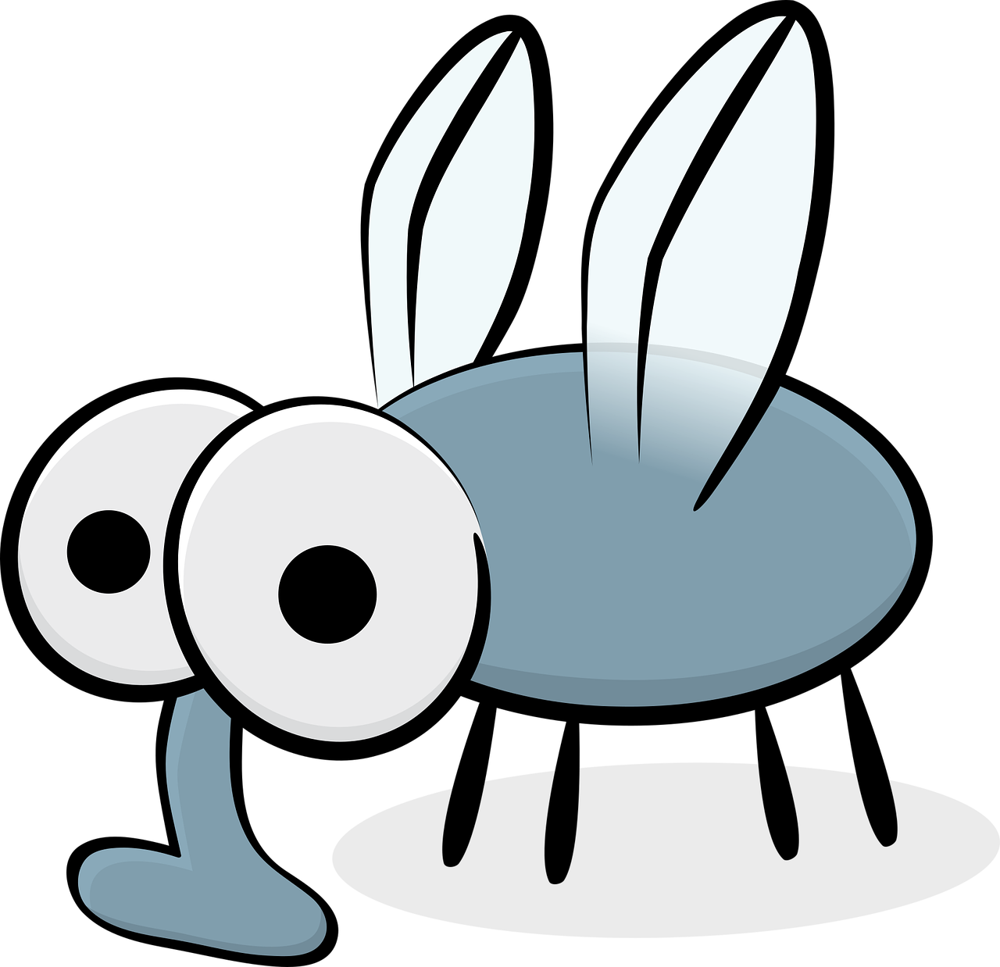
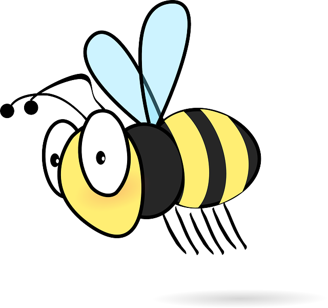

# Mosquito Splasher

**Mosquito Splasher** egy szórakoztató játék, amelyben a feladatod, hogy szúnyogokat, méheket és büdösbogarakat csapj le a lehető legjobb eredmény eléréséhez. A játék gyors reflexeket és pontos célzást igényel, legyen szó egér vagy kézmozdulatok használatáról!

## Függőségek

A játék futtatásához az alábbi Python csomagokat kell telepíteni:

```bash
python.exe -m pip install --upgrade pip
pip install pygame
pip install mediapipe
pip install opencv-python
```

## Játékmenet összefoglaló

A **Mosquito Splasher** egy olyan játék, ahol különböző rovarok úsznak be a képernyőre:

- **Szúnyogok**</br>


- **Méhecskék**</br>


- **Büdösbogarak**</br>


### Játékszabályok

A célod, hogy minél több pontot gyűjts, és minél tovább életben tartsd a játékidőt, amely alapból **1 perc**.

- **Szúnyog lecsapása**: +1 pont
- **Méhecske lecsapása**: -1 pont és 10 másodperc veszteség a játékidőből
- **Büdösbogár lecsapása**: +15 másodperc játékidő nyereség

Minden lecsapásnak saját hanghatása van, és a játéknak is van háttérhangja, így a hangélmény növeli az izgalmat.

### Játékmenet opciók

A **Mosquito Splasher** lehetőséget ad kétféle vezérlési módra:

- **Egér móddal**: Az objektumok egérrel történő lecsapásához kattints rájuk a bal egérgombbal.

- **Kéz móddal**:
  - **Mozgás**: Mozgasd a kezed, hogy irányítsd a játékbeli kéz objektumot.
  </br>

  - **Lecsapás**: Mozgasd a kezed a játékobjektum fölé, majd ökölbe szorítással aktiváld a lecsapást (MediaPipe kézmozdulat-követés segítségével).
  - **Lagg**: A kéz módban a játék laggol, nem tudtam rájönni az okára, a képfeldolgozással lesz valami probléma.

### Játék vége és pontszám mentése

Amikor az idő lejár:

- Megjelenik a **Game Over** képernyő, amely kiírja az aktuális pontszámodat.
- A pontszám és a pontos időbélyeg (*timestamp*) JSON formátumban mentésre kerül az `own_io` mappában található fájlba.

### Játék indítás
```bash
python game.py
```

### GitHub
[python-exam-project](https://github.com/AdamGyarmati/python-exam-project)

**Jó szórakozást, és csapj le minél több szúnyogot anélkül, hogy túl sok méhecskét bántanál!**
